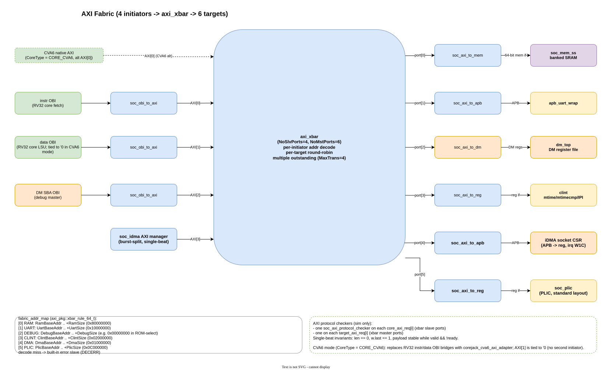
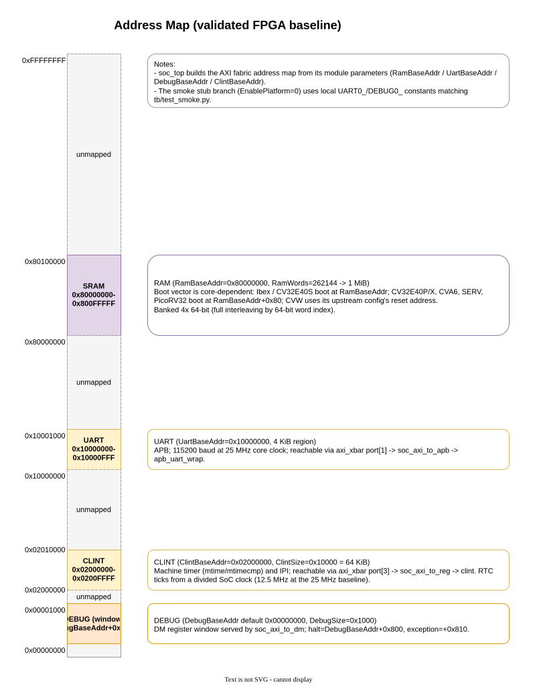

# AXI4 Fabric

The CoreJack platform uses AXI4 as the central SoC fabric. Core sockets may use
their native protocol at the core boundary, but shared memory, UART, and debug
traffic are routed through one explicit AXI address-decode path.

## Architecture

Current RV32 cores expose separate instruction and data OBI-style interfaces.
The debug module exposes a system bus access path for GDB/OpenOCD memory loads.
Inside `soc_top`, these initiators become AXI initiators:

- instruction OBI through `soc_obi_to_axi`
- data OBI through `soc_obi_to_axi`
- debug SBA OBI through `soc_obi_to_axi`

The three AXI initiators enter a PULP `axi_xbar` system crossbar. The crossbar
decodes each initiator's address independently and routes the request to one of
the fabric targets:

- RAM through `soc_axi_to_mem`
- UART through `soc_axi_to_apb`
- debug module register/ROM window through `soc_axi_to_dm`
- CLINT through `soc_axi_to_reg`

Because address decode is per initiator and arbitration is per target (inside
the crossbar's per-master-port multiplexers), initiators targeting different
targets proceed concurrently; arbitration only happens when two initiators
address the same target. This replaced the earlier single-outstanding
`soc_axi_arbiter` + `soc_axi_demux` pair, which funnelled all initiators through
one shared transaction stream and serialized the whole fabric. The crossbar
forwards multiple outstanding requests (`MaxMstTrans` / `MaxSlvTrans`), so the
already-banked SRAM (see [memory throughput](#memory-throughput-is-no-longer-fabric-limited))
can finally see parallel traffic. Decode misses are answered by the crossbar's
built-in error slave with `RESP_DECERR` (and implementation-defined poison read
data), rather than the demux's former hand-rolled `0`-data error response.

The crossbar prepends the initiator (slave-port) index to the AXI ID so each
target's response routes back to the right initiator. Its master ports
therefore carry a wider ID than the initiator side (`AxiIdWidth + $clog2(N)` for
`N` initiators); `soc_bus_pkg` defines the matching `soc_axi_mst_*` types and
the target adapters are parameterized to accept them.

CVA6 is integrated as a native AXI core: its initiator port enters the crossbar
directly instead of going through an OBI-to-AXI adapter.

The board wrapper does not own this policy. Board wrappers only adapt clocks,
resets, FPGA primitives, and physical IO pins.



## Address Map

`soc_top` builds the active AXI decode table from its address parameters:

| Target | Parameter | Default Base | Size |
| --- | --- | ---: | ---: |
| Debug module window | `DebugBaseAddr` | `0x00000000` | `0x00001000` |
| CLINT | `ClintBaseAddr` | `0x02000000` | `0x00010000` |
| UART | `UartBaseAddr` | `0x10000000` | `0x00001000` |
| RAM | `RamBaseAddr` | `0x80000000` | `RamWords * 4` |

The decode windows are exclusive at the upper bound: `[base, base + size)`.
The static address-map check (`make axi-addr-map-check`) verifies that these
windows are non-overlapping.



## Memory Width

The shared SRAM path is 64-bit wide. This is the baseline for future RV64 cores
and AXI-native memory integration.

RV32 cores keep a 32-bit core-facing contract. The local width adaptation uses
the byte address to select the low or high 32-bit lane of a 64-bit SRAM word,
and carries that lane selection until the response returns.

Simulation preload files use one 64-bit word per line.

## Protocol Checks

Simulation builds instantiate `soc_axi_protocol_checker` on the core-side AXI
ports and the target-side AXI ports. (There is no longer a single central
fabric port to check: the crossbar decodes per initiator and arbitrates per
target, so the per-initiator and per-target checkers cover the fabric ends.)
The checker guards the subset used by this platform:

- payload stability while `valid` is asserted and `ready` is low
- stable read and write responses while the receiver applies backpressure
- single-beat transactions only: `len == 0` and `w.last == 1`

This is not a full AXI formal proof. It is a focused regression guard. The
single-beat assertions still hold: the current initiators emit single-beat
transactions, and the crossbar buys concurrency and multiple-outstanding rather
than bursts. The assertions are the guard that will flag the first burst-capable
initiator added later.

## Current Scope

The current platform use case is:

- single-beat transfers per initiator
- multiple outstanding transactions across the crossbar (one accepted transfer
  at a time within each target adapter, but distinct initiators/targets in
  flight concurrently)
- 32-bit core-side instruction/data access for current RV32 cores
- 64-bit AXI/memory data width inside the platform

This is sufficient for the currently supported flows: the OBI-style RV32
cores (Ibex, CV32E40P, CV32E40S) and the small core-specific adapters used
by SERV, PicoRV32, and CVW/Wally all reach RAM, UART, CLINT, and debug
through the same shared crossbar, and CVA6 enters that crossbar as a native
single-beat AXI initiator. AXI-native initiators with bursts should still be
introduced deliberately: the per-target adapters and the single-beat protocol
checker assume `len == 0` today, so adding bursts means revisiting those, not
extending the small adapters ad hoc.

### Memory throughput is no longer fabric-limited

The shared SRAM is banked (see `MemNumBanks` on `soc_top`, default 4, and
`soc_mem_ss`'s per-bank round-robin arbiter). Three independent initiators reach
the fabric - core instruction fetch, core data access, and debug SBA - and each
can target a different bank. Previously they could not run in parallel against
the banks: the old `soc_axi_arbiter` was single-outstanding, accepting at most
one transaction at a time for the whole fabric, so the bank fan-out behind it
saw no contention. The `axi_xbar` removed that funnel - per-target arbitration
with multiple outstanding requests lets distinct initiators reach distinct
banks concurrently.

Because the crossbar can now present a read (e.g. instruction fetch) and a write
(e.g. a data store) to the RAM target in the same cycle, `soc_axi_to_mem`
arbitrates the two with a starvation-free round-robin. The earlier adapter gated
each AXI channel on the other's `valid`, which deadlocked under simultaneous
read+write - a case the old serializing arbiter never produced. The peripheral
adapters still use the simpler single-initiator arbiter; see
[`open_items.md`](open_items.md).

The remaining follow-up is **revisiting the bank count** once a second
concurrent initiator (for example the planned uDMA on `accel_socket_if`) is
actually exploiting the bank parallelism the crossbar now exposes.
`soc_top.MemNumBanks` is a parameter, so experiments at 8 or 16 banks need only
an override at instantiation; `sw/Makefile` already responds to a matching
`NUM_BANKS` value when regenerating hex preload files. See
[`roadmap.md`](roadmap.md) for the coupling between `MemNumBanks` and the
initiator count.

## Acceptance

Run the focused adapter regression:

```bash
make axi-adapter-sim
```

Run the full AXI fabric smoke:

```bash
make axi-smoke
```

`make axi-smoke` checks:

- AXI decode windows do not overlap
- OBI-to-AXI, AXI-to-memory, AXI-to-APB, AXI-to-DM, the `axi_xbar` system
  crossbar (including cross-target concurrency and same-target arbitration), AXI
  protocol-checker, and 32-to-64-bit lane behavior through `axi-adapter-sim`
- debug-window and SBA behavior through `debug-sim`
- `hello_world` simulation on each supported core

The default supported-core simulation set is controlled by `AXI_SMOKE_CORES`
in the Makefile and currently covers `ibex`, `cv32e40p`, `cv32e40s`, `cva6`,
`serv`, `picorv32`, and `cvw`.

Unsupported cores are not part of the default AXI smoke target and their
optional RTL dependencies are not required for the default `debug-sim` gate.

FPGA acceptance remains a separate hardware gate:

```bash
make fpga-accept BOARD=<board> UART_DEV=/dev/ttyUSBx
```

Debug-capable cores use OpenOCD/GDB in that gate. Supported cores without a
RISC-V debug interface use the UART SRAM loader.

## Future Work

The AXI fabric baseline is complete for the currently supported cores
(RV32 OBI sockets, native AXI for CVA6, and the small adapters used by
SERV, PicoRV32, and CVW/Wally). Future work is separate from the migration
closure:

- stress debug SBA and memory contention more heavily (the `axi-adapter-sim`
  concurrency tests are a first step)
- add burst support (target adapters and the single-beat protocol checker) when
  an AXI-native burst initiator is integrated; the crossbar itself already
  forwards multiple outstanding requests
- revisit `MemNumBanks` once a second concurrent initiator exploits the bank
  parallelism the crossbar now exposes
- re-validate FPGA timing closure with the crossbar on the fabric path; if the
  conservative 25 MHz target regresses, the crossbar's `LatencyMode` (e.g.
  `CUT_ALL_AX`) is the first knob to try
