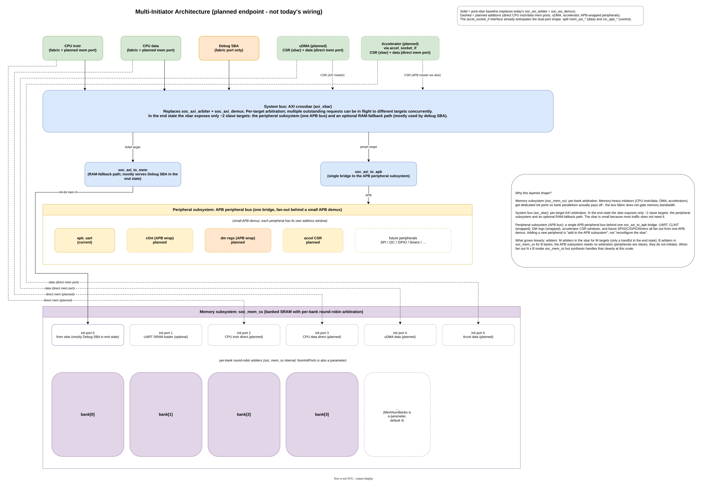

# Roadmap

This document records the current direction for CoreJack across cores, boards,
software, and the SoC platform. For the descriptor-derived support table, see
[`support_matrix.md`](support_matrix.md). For the validation gates used to
promote a core, see [`core_acceptance_checklist.md`](core_acceptance_checklist.md).

## Current Baseline

The first FPGA board target `axku5` is hardware-validated across the
supported core set. A second board, `arty_a7_100t` (Arty A7-100T, Artix-7),
is now also hardware-validated across the supported core set: a full
`make fpga-accept` regression builds a bitstream, programs the board, and runs
bare-metal `hello_world` for all seven cores - OpenOCD/GDB load/run for the
debug-capable cores (ibex, cv32e40p, cv32e40s, cva6) and the UART SRAM loader
for the rest (serv, picorv32, cvw). Zephyr console/timer smoke on Arty is
validated with Ibex.

Platform pieces:

- The generic `soc_top` smoke simulation passes.
- The generic cocotb software simulation passes with compiled C tests.
- The central AXI4 fabric routes core instruction, core data, and debug SBA
  traffic into the shared SRAM, APB UART, debug module, and CLINT targets.
  See [`axi4_fabric.md`](axi4_fabric.md).
- The banked 64-bit SRAM (`soc_mem_ss`) uses per-bank round-robin
  arbitration and exposes a separate init port that the AXI fabric, the
  simulation preloader, and the optional UART SRAM loader share.
- `riscv-dbg` (`dmi_jtag` + `dm_top`) and CLINT are integrated in `soc_top`.
- The AXKU5 bitstream closes timing at the conservative `25 MHz` default.
- OpenOCD enumerates and examines the RISC-V target over external JTAG;
  GDB loads an ELF into SRAM through the debug module SBA path.
- `hello_world` runs from SRAM and prints through the platform APB UART at
  `115200` baud on every supported core.
- Zephyr `initial_supported` smoke runs on the Zephyr-capable supported
  cores; see [`zephyr_bringup.md`](zephyr_bringup.md).

The known-good `hello_world` UART output for debug-capable cores is:

```text
=== CoreJack SoC Demo ===
Target: fpga
Core: <core>
Board: axku5
UART base: 0x10000000
Clock: 25000000 Hz, baud: 115200
UART and JTAG debug path are alive.
```

UART-loader cores end with `UART path is alive.` instead.

A 50 MHz FPGA experiment generated a bitstream but missed routed timing by
about `4.7 ns` WNS on a route-dominated path. This remains a future
timing-closure task rather than a baseline blocker.

## Per-Core Notes

The authoritative descriptor-derived matrix lives in
[`support_matrix.md`](support_matrix.md). Notes per core:

- **Ibex** - reference baseline: simulation, FPGA, OpenOCD/GDB debug, Zephyr
  initial smoke.
- **CV32E40P** - simulation, FPGA, OpenOCD/GDB load/run with
  halt/breakpoint/step debug validated. Zephyr initial.
- **CV32E40S** - simulation, FPGA, OpenOCD/GDB load/run with single-step
  validated. The adapter passes core reset-status state into
  `dm_top.unavailable_i`; see
  [`core_acceptance_checklist.md`](core_acceptance_checklist.md). Zephyr
  initial.
- **CVA6** - native AXI core path; simulation, FPGA, OpenOCD/GDB
  load/run/single-step validated. Zephyr initial (RV64).
- **CV32E40X** - demoted from the supported set. Instruction-fetch and
  vector behavior diverge from the other cores and are tracked upstream
  in [`cv32e40x_boot_issue.md`](cv32e40x_boot_issue.md). It is intentionally
  excluded from default regressions until the upstream behavior is resolved.
- **SERV** - bit-serial low-area core. Bare-metal `hello_world` runs in
  simulation through a local socket adapter and on FPGA through the UART
  SRAM loader. Zephyr boots through the same loader path with a
  board-specific idle override to avoid `wfi`. OpenOCD/GDB debug is
  unsupported.
- **PicoRV32** - bare-metal `hello_world` runs in simulation through a local
  socket adapter and on FPGA through the UART SRAM loader. OpenOCD/GDB debug
  is unsupported. Zephyr is unsupported because PicoRV32's custom IRQ
  instruction interface does not match Zephyr's standard RISC-V trap/CSR
  model.
- **CVW/Wally** - bare-metal `hello_world` runs in simulation through a
  local AHB-Lite adapter and on FPGA through the UART SRAM loader.
  OpenOCD/GDB debug is unsupported.

## Near-Term Priorities

Hardware regression and stability:

- Keep at least one known-good core/board target as the stable regression
  baseline.
- Keep the debug ROM fetch and SBA simulation checks in the regression
  baseline.
- Keep board LED mappings as simple status; add richer probes only when a
  specific debug investigation needs them.
- Keep `25 MHz` as the conservative FPGA default and treat higher clocks as
  a later timing-closure task.

Software and validation flow:

- Keep the generic cocotb software test flow as the main pre-silicon
  validation path for bare-metal C tests.
- Keep Zephyr timer-smoke coverage as the initial software-stack regression
  for the supported core/board pairs.
- Keep the UART SRAM loader path as the supported FPGA load flow for the
  non-debug cores (SERV, PicoRV32, CVW/Wally).

## Platform Architecture Direction

- Treat AXI4 as the central SoC fabric. Core-native buses are allowed at
  the core adapter boundary but must reach RAM, UART, CLINT, debug, and
  other shared peripherals through the shared AXI fabric.
- Keep the memory subsystem modular and multi-initiator aware. The
  `soc_mem_ss` per-bank round-robin arbiter is already generic in
  `NumBanks` and `NumInitPorts`, and `soc_top.MemNumBanks` is a
  parameter (default 4) - so the platform is set up to grow the bank
  count when a workload warrants it.
- Widen the AXI fabric. **Done (sim- and hardware-validated):** the
  single-outstanding `soc_axi_arbiter` + `soc_axi_demux` pair has been replaced
  by a PULP `axi_xbar` system crossbar, so today's three initiators (core
  instruction, core data, debug SBA) decode per initiator and arbitrate per
  target with multiple outstanding requests, instead of serializing upstream of
  the banked memory. This paid off with the *existing* initiator set - it was
  not blocked on AXI-native burst initiators arriving. Validated by the full
  `make axi-smoke` simulation set and by a full `make fpga-accept` regression on
  the Arty A7-100T across all seven supported cores; the crossbar closes timing
  at the 25 MHz default (ibex WNS +6.5 ns). See
  [`axi4_fabric.md`](axi4_fabric.md).
- Adopt a layered interconnect as the platform endpoint, structured as
  three named subsystems: a **memory subsystem** (`soc_mem_ss`, per-bank
  round-robin arbitration); a **system bus** (PULP `axi_xbar` - per-target
  arbitration, multiple outstanding requests; **this is now in place**,
  having replaced the `soc_axi_arbiter` + `soc_axi_demux` pair); and a
  **peripheral subsystem** (a single APB peripheral bus behind one `soc_axi_to_apb`
  bridge, carrying UART today and CLINT-wrap / DM-regs-wrap / accel CSR /
  future SPI/I2C/GPIO/timers in the end state). Memory-heavy initiators
  (CPU instr and data via planned direct mem ports, DMA, accelerators,
  and any future caches) get **two ports**: a system AXI master for
  CSR/control that lands on the xbar, and a dedicated `soc_mem_ss`
  init port for the data path that bypasses the xbar entirely. This is
  the canonical pattern at CoreJack's scale - Cheshire, Carfield, and
  similar PULP-based platforms use the same shape, and it is what
  `accel_socket_if`'s split `mem_axi_*` / `csr_apb_*` ports already
  anticipate. The layered picture is documented in the
  *Multi-Initiator Architecture (planned)* tab of
  [`media/corejack_soc.drawio`](media/corejack_soc.drawio) and shown
  below:



- Keep `soc_top` board-agnostic. Board wrappers provide only clock/reset,
  FPGA primitives, constraints, and physical pin wiring.
- Continue evolving the descriptor-driven `CORE=<core>` / `BOARD=<board>`
  selection so new combinations do not require hand-editing scattered build
  logic.

## Core And Board Expansion

- Add more cores under the same socket and AXI fabric contract using
  [`core_porting.md`](core_porting.md) and the `make new-core` scaffold.
- Add more FPGA boards behind thin board wrappers using
  [`board_porting.md`](board_porting.md) and the `make new-board` scaffold.
- Use [`core_acceptance_checklist.md`](core_acceptance_checklist.md) as the
  promotion gate for `integration.sim`, `integration.fpga`, and
  `integration.debug`.

Planned next FPGA board target:

- **Digilent Arty A7-100T** (Xilinx Artix-7 `xc7a100tcsg324-1`) - a
  lower-cost reference target to complement the current AXKU5 baseline and
  to validate that the generic `soc_top` integration works on a smaller,
  non-UltraScale+ FPGA family. Bring-up will use the same `make new-board`
  scaffold and the standard descriptor / wrapper / XDC / board FuseSoC core
  structure documented in [`board_porting.md`](board_porting.md).

## System IP And Accelerator Expansion

CoreJack sketches an accelerator socket interface
(`rtl/interfaces/accel_socket_if.sv`) alongside the core socket. As of
the current baseline, this interface is a **declared contract, not a
validated one**: it exists in source but has no consumer in the
platform yet. The "jack in an IP" pitch in [`about.md`](about.md)
describes the intent, and the planned uDMA integration below will be
the first real user of the socket - that integration will validate the
power/reset, AXI memory, APB CSR, and IRQ pieces of the contract end
to end, and will likely shape its final form.

The direction is to grow the set of integrated system IP that plugs
into the shared AXI fabric the same way cores do, so hobbyists and IP
developers can validate new blocks against a real CPU on real hardware
without rebuilding the integration layer.

Candidate near-term additions (planned, not yet started):

- **DMA engine**: the leading candidate is the OpenHW Group CORE-V MCU
  uDMA. A DMA is a natural first accelerator-class block because it
  exercises the multi-initiator AXI fabric and gives bare-metal and
  Zephyr applications a non-CPU initiator to drive from C.
- **More APB peripherals**: SPI, I2C, GPIO, and additional timers behind
  the existing APB peripheral path so applications have more to talk to.
- **User accelerators**: small fixed-function blocks driven from C
  through MMIO, exercising the descriptor-driven build flow for custom
  IP.

Adding a new system IP follows the same pattern as adding a core: a
small descriptor or FuseSoC plugin, a thin adapter into the AXI/APB
fabric, an address window declared in `soc_top`, an optional cocotb
test under `tb/`, and software headers under `sw/c/common/`. The
descriptor and acceptance machinery already in place for cores and
boards will be extended to cover this class of IP as it lands.

### Single-port vs dual-port integration

A new initiator integrates into the platform in one of two ways. Both
are first-class; the choice is workload-driven, not architectural.
(Note: this is about an *initiator's* integration cost - it is
**not** the same thing as the three architectural subsystems shown
in the *Multi-Initiator Architecture (planned)* tab of
[`media/corejack_soc.drawio`](media/corejack_soc.drawio), which are
the layers of the interconnect itself.)

- **Single-port (xbar-only)**: the initiator has one AXI master port
  that lands on `axi_xbar` (the system bus). Through the xbar's two
  slave paths (`soc_axi_to_mem` for RAM and `soc_axi_to_apb` for the
  APB peripheral subsystem) it reaches the **entire** memory map -
  RAM, UART, CLINT, debug-module registers, accelerator CSR windows,
  and any future peripheral on the APB subsystem. Debug SBA is the
  current example. Future debug/trace controllers, security blocks,
  interrupt aggregators, and any other low-traffic master fit here
  too. The integration cost is just one AXI master port on the xbar.

- **Dual-port**: the initiator has both a fabric port (CSR/control,
  lands on the xbar) and a dedicated `soc_mem_ss` init port (data,
  bypasses the xbar). A small egress decoder at the initiator side
  picks which port to use per transaction, based on the target
  address. Worth doing only when the initiator's data bandwidth
  would saturate the xbar's RAM-fallback path: CPU instruction and
  data direct ports, DMA streams, and accelerator data flows are the
  candidates. `accel_socket_if` already anticipates this shape with
  split `mem_axi_*` and `csr_apb_*` ports.

The dual-port pattern is an **optimization**, not a requirement. The
default is single-port; you only upgrade an initiator to dual-port
when a measured workload shows the xbar's RAM path is the bottleneck.
This is what gives the platform a clean ramp: the cheap integration
already buys full reachability, and the data-path optimization is
local and incremental when an initiator earns it.

Two safety nets keep this honest. `soc_mem_ss` checks each init port
against its `BaseAddr` / `RamSize`, so an accidentally misrouted
non-RAM access on a direct mem port errors cleanly rather than
corrupting state. The xbar's address map is exclusive, so any AXI
transaction with an address outside any declared slave window also
errors cleanly. The dual-port egress decoder doesn't have to be
perfect - it has to be *mostly* right, and the boundaries catch
mistakes.

### Memory subsystem follow-up

Once a second concurrent initiator lands (uDMA being the leading
candidate) and the AXI fabric is widened to exploit today's three
initiators in parallel, the bank count revisit becomes concrete. The
infrastructure is already in place:

- `soc_mem_ss` is generic over `NumBanks` and `NumInitPorts`.
- `soc_top.MemNumBanks` is a parameter (default 4); overriding it at
  instantiation is enough to experiment with 8 or 16 banks.
- `sw/Makefile` exposes a matching `NUM_BANKS` knob so hex preload
  files line up with whatever the RTL chose.

`MemNumBanks` and `NumInitPorts` are **coupled** tuning levers: as
`NumInitPorts` grows toward the end-state ~6 (CPU instr direct + CPU data
direct + xbar fallback + UART loader + uDMA + accelerator),
`MemNumBanks` should grow with it. The textbook `B ≈ 2·N` heuristic
assumes pathologically random independent address streams (DRAM-style or
NoC-style worst-case), which is not what CoreJack carries: CPU
instruction fetch, CPU data, DMA, and most accelerators have highly
structured sequential or strided access patterns. Under round-robin
arbitration, sequential streams self-align within a handful of cycles
even at `B = N`, so the realistic target is **`MemNumBanks ≈ NumInitPorts`**
(for example, 8 banks alongside the end-state ~6 init ports). Total SRAM
bit count stays constant; only per-bank capacity changes. Bumping beyond
that (12 or 16 banks) is a future option to revisit only if a measured
workload — a worst-case all-accelerators-streaming benchmark, for
example — shows real bank pressure.

What is intentionally **not** done yet, pending real workload evidence:
threading the bank count through the board descriptor, the FPGA wrapper,
the Zephyr devicetree, and the bitstream manifest, so the choice becomes
descriptor-driven rather than a manual override. That plumbing is a
small follow-up best designed when there is a second value worth
supporting (for example, AXKU5 stays at 4 while a different board or
benchmark configuration opts into 8).

## Software Ecosystem

- Continue improving the generic bare-metal software flow under `sw/c/`.
- Expand Zephyr beyond the current `initial_supported` timer-smoke level
  for the supported core/board pairs.
- Define the missing RTOS-facing platform services explicitly before
  promoting any core to `software.zephyr.status: supported`. This includes
  automated FPGA timer-smoke acceptance, Zephyr flash/debug runner
  integration, a simulation acceptance path, and broader regression
  coverage.

## Longer-Term Direction

- Evaluate AXI vs. TileLink vs. other fabrics for the long-term SoC
  integration boundary while keeping that choice orthogonal to board and
  core selection.
- Stress the debug SBA and memory contention paths beyond the current
  single-beat regression set as more AXI-native initiators are added.
- **Caches: TBD.** Some upstream cores already include caches (CVA6 has
  full L1 instruction and data caches by design; Ibex has an optional L1
  instruction cache; CV32E40P/S/X, SERV, PicoRV32, and CVW do not bring
  any). Adding caches at the CoreJack *platform* layer - for example,
  small shared L1 instruction and/or data caches sitting in front of the
  CPU's planned direct `soc_mem_ss` mem ports - could reduce CPU
  memory pressure for cores that don't bring their own and would give
  the platform meaningful cache-aware behavior for workloads that benefit.
  Open questions, all currently TBD: (1) **where** the caches would sit
  (inside `corejack_core_region` per-core, or as a shared block on the
  memory path between the CPU direct ports and `soc_mem_ss`); (2)
  **which** cores would actually benefit (most embedded cores tolerate
  uncached SRAM at the AXKU5 baseline clock just fine); (3) **how** they
  interact with debug-SBA visibility (cache-coherent access through the
  same caches, vs cache bypass on SBA, vs cache flush on debug entry);
  and (4) **whether** the area cost is justified for hobbyist /
  educational workloads where the uncached path is rarely the bottleneck.
  Revisit when there is workload evidence that the uncached CPU access
  pattern is the limiting factor. This belongs alongside any conversation
  about widening the system bus and reshaping `accel_socket_if` for
  cache-coherent accelerators.
- Add an optional LLVM/Clang software toolchain alongside the current
  GCC/Newlib default once it has matching compile, simulation, ELF loading,
  and debug validation for the relevant cores.
