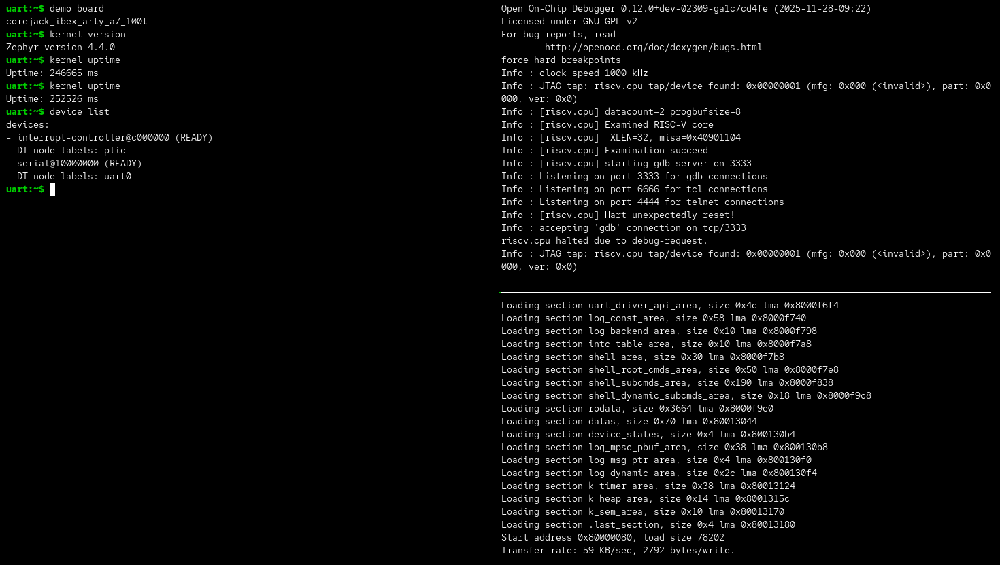

Zephyr Shell on an FPGA Board
=============================

This walkthrough takes a fresh checkout to an interactive Zephyr shell on real
hardware: Zephyr's own shell sample, running on Ibex on the Digilent Arty
A7-100T, with its console on the board's USB UART. It uses three terminals -
OpenOCD, the serial console, and the load - shown here side by side in tmux.

         kernel version, kernel uptime, and device list; OpenOCD connected to
         the core at the top right; the GDB load of the shell image at the
         bottom right.

The shell takes keyboard input because the console UART is interrupt-driven
through the platform interrupt controller (PLIC); see
:doc:`Zephyr bring-up <zephyr_bringup>` for the platform details.

What You Need
-------------

-  An Arty A7-100T and its USB cable. That one cable carries both the FPGA
   programming interface and the console UART.
-  An Olimex ARM-USB-TINY wired to the Arty's Pmod connector ``JD``, for the
   RISC-V debug connection that loads the software. The pin map is in
   :doc:`External JTAG wiring <jtag_wiring>`.
-  Vivado, OpenOCD, and the RISC-V toolchain (which includes GDB). Check what is
   missing with:

   .. code:: bash

      source sourceme.sh
      make check-tools FLOW=debug CORE=ibex BOARD=arty_a7_100t

One-Time Setup
--------------

Run these from the repository root. ``make toolchain-riscv`` is only needed if
the RISC-V toolchain is not installed yet (see :doc:`Tooling <tooling>`), and
the bitstream build takes several minutes.

.. code:: bash

   source sourceme.sh
   make toolchain-riscv                        # skip if already installed
   make bender && make deps                    # external HDL dependencies
   make zephyr-init                            # Zephyr workspace under .tools/
   make zephyr-python-deps                     # Zephyr's Python build requirements
   make fpga-bit CORE=ibex BOARD=arty_a7_100t  # the Arty + Ibex bitstream

Program The FPGA
----------------

.. code:: bash

   make fpga-pgm CORE=ibex BOARD=arty_a7_100t

The FPGA forgets its configuration when the board powers off, so repeat this
after a power cycle.

Find The UART
-------------

The Arty's USB interface appears as two serial ports with the same serial
number: interface ``if00`` is the FPGA programming port and ``if01`` is the
console UART. List them with:

.. code:: bash

   ls -l /dev/serial/by-id/

and use the ``if01`` entry, which looks like
``usb-Digilent_Digilent_USB_Device_<serial>-if01-port0``. The stable
``by-id`` name is safer than ``/dev/ttyUSB<n>``, whose number depends on the
order the USB devices were plugged in.

Run The Shell
-------------

Start three terminals, or three tmux panes, in the repository root, each with
``source sourceme.sh``. Open the console before loading, so it catches the
boot messages.

1. **OpenOCD** (top right in the screenshot) - connects to the core over the
   Olimex adapter and stays running:

   .. code:: bash

      make openocd CORE=ibex BOARD=arty_a7_100t

2. **Console** (left) - the serial terminal for the shell:

   .. code:: bash

      picocom -b 115200 /dev/serial/by-id/usb-Digilent_Digilent_USB_Device_<serial>-if01-port0

3. **Load** (bottom right) - builds Zephyr's shell sample for this core and
   board, loads it over JTAG, and starts it:

   .. code:: bash

      make fpga-zephyr-shell CORE=ibex BOARD=arty_a7_100t

The console prints Zephyr's boot banner and then the ``uart:~$`` prompt; press
Enter if the prompt is not visible yet.

What You Should See
-------------------

A few commands that show the platform underneath the shell:

.. code:: text

   uart:~$ demo board
   corejack_ibex_arty_a7_100t
   uart:~$ kernel version
   Zephyr version 4.4.0
   uart:~$ kernel uptime
   Uptime: 246665 ms
   uart:~$ device list
   devices:
   - interrupt-controller@c000000 (READY)
     DT node labels: plic
   - serial@10000000 (READY)
     DT node labels: uart0

``demo board`` names CoreJack's own Zephyr board definition, ``kernel uptime``
advancing between calls shows the machine timer interrupt at work, and
``device list`` shows the PLIC and the UART. ``kernel thread list`` shows the
running threads and their stack use.

``help`` lists everything the sample offers:

.. code:: text

   uart:~$ help
   Please press the <Tab> button to see all available commands.
   You can also use the <Tab> button to prompt or auto-complete all commands or its subcommands.
   You can try to call commands with <-h> or <--help> parameter for more information.

   Shell supports following meta-keys:
     Ctrl + (a key from: abcdefklnptuw)
     Alt  + (a key from: bf)
   Please refer to shell documentation for more details.

   Available commands:
     bypass              : Bypass shell
     clear               : Clear screen.
     date                : Date commands
     demo                : Demo commands
     device              : Device commands
     devmem              : Read/write physical memory
                           Usage:
                           Read memory at address with optional width:
                           devmem <address> [<width>]
                           Write memory at address with mandatory width and value:
                           devmem <address> <width> <value>
     dynamic             : Demonstrate dynamic command usage.
     help                : Prints the help message.
     history             : Command history.
     kernel              : Kernel commands
     log                 : Commands for controlling logger
     log_test            : Log test
     rem                 : Ignore lines beginning with 'rem '
     resize              : Console gets terminal screen size or assumes default in
                           case the readout fails. It must be executed after each
                           terminal width change to ensure correct text display.
     retval              : Print return value of most recent command
     section_cmd         : Demo command using section for subcommand registration
     shell               : Useful, not Unix-like shell commands.
     shell_uart_release  : Uninitialize shell instance and release uart, start
                           loopback on uart. Shell instance is reinitialized when
                           'x' is pressed
     stats               : Stats commands
     version             : Show kernel version

Two lines in the OpenOCD pane can look alarming but are expected:

-  ``Hart unexpectedly reset!`` - the load starts with a reset of the core, and
   OpenOCD reports it.
-  ``tap/device found: 0x00000001 (mfg: 0x000 (<invalid>) ...)`` - that is
   the JTAG ID code of the ``riscv-dbg`` debug module, left at its placeholder
   value; OpenOCD finds and examines the core normally.

Stopping
--------

-  The load pane keeps its GDB session open for ``ZEPHYR_SHELL_TIMEOUT``
   seconds (default 3600); Ctrl-C ends it sooner.
-  Ctrl-C stops OpenOCD.
-  In picocom, Ctrl-A followed by Ctrl-X exits.

Other Cores And Boards
----------------------

The same three commands work for the other Zephyr targets loaded over JTAG:
``CORE=ibex``, ``cv32e40p``, ``cv32e40s``, or ``cva6`` with ``BOARD=axku5``. On
the AXKU5 the debug adapter is a Tigard and the console is a separate CP2102N
USB UART; :doc:`External JTAG wiring <jtag_wiring>` has both boards. SERV has
no JTAG debug path, so ``fpga-zephyr-shell`` rejects it.

Troubleshooting
---------------

-  **No prompt:** press Enter; check that picocom opened the ``if01`` port at
   115200 baud; check that ``fpga-pgm`` ran since the last power cycle.
-  **OpenOCD cannot find or examine the target:** check the Olimex wiring to
   ``JD`` and that the FPGA is programmed; see
   :doc:`External JTAG wiring <jtag_wiring>` and
   :doc:`FPGA debug stepping <fpga_debug_stepping>`.
-  **The load fails to connect:** OpenOCD must be running first, and nothing
   else may hold its GDB port (3333).
